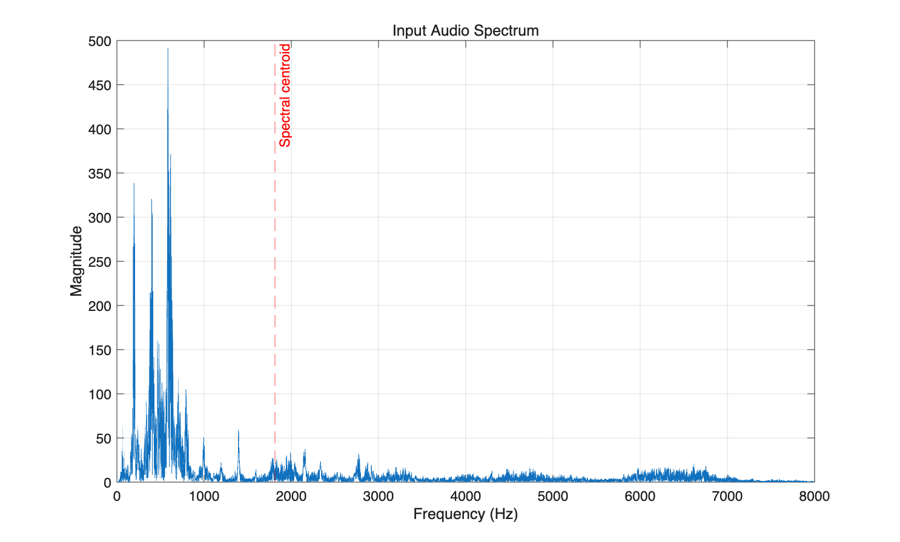
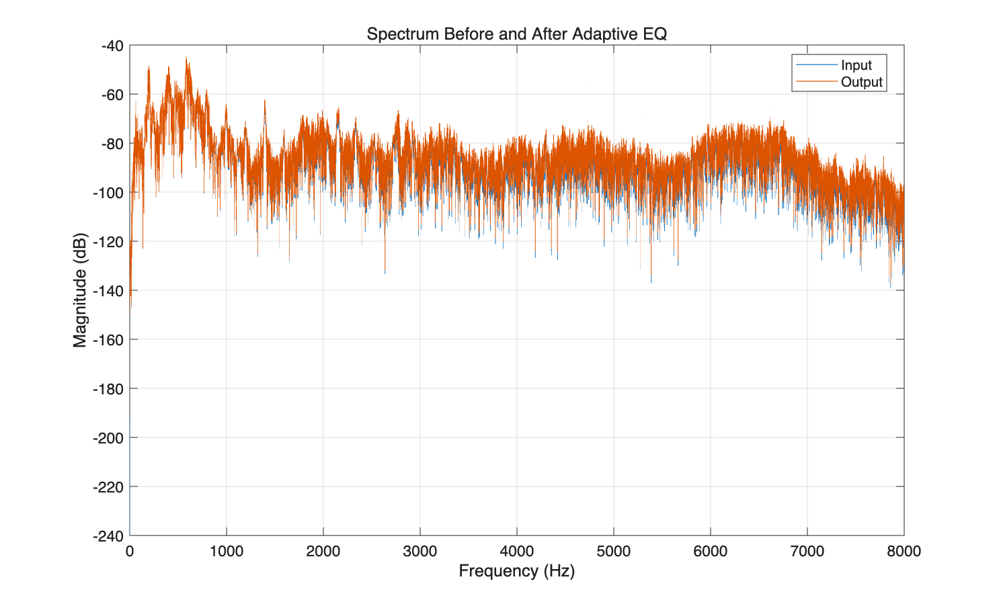
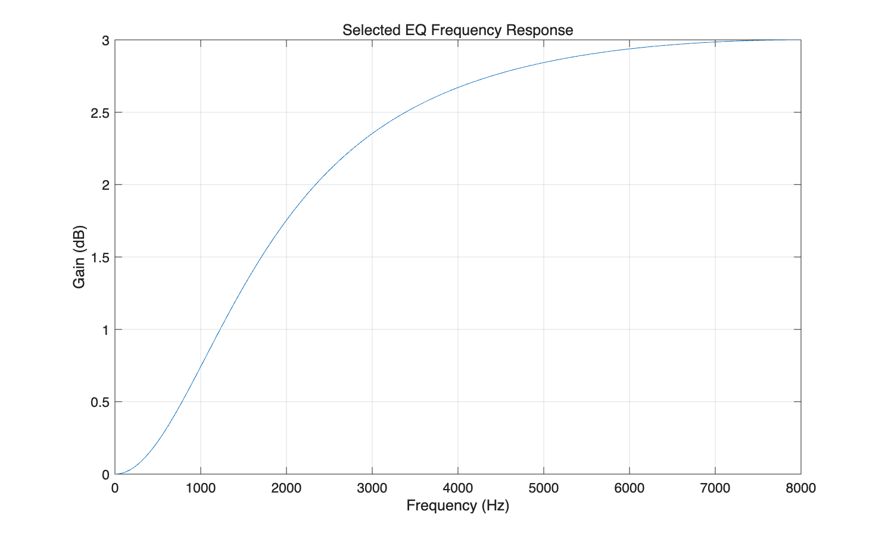

# Adaptive Audio Equaliser Using Spectral Feature Analysis

This project is developed for ELEC5305.

The aim is to develop a lightweight adaptive audio equaliser that adjusts EQ settings based on the spectral characteristics of an input audio signal. The project mainly uses spectral centroid to estimate the brightness of the audio and select a simple EQ adjustment.

## Background

Spectral centroid is related to the perceived brightness of a sound [1]. This makes it a useful feature for analysing audio in this project.

Previous studies have explored automatic audio equalisation using deep learning to choose filter parameters [2] and adjust individual instrument tracks [3]. This project starts with a simpler rule-based method in MATLAB.

## Method

The basic processing flow is:

Audio Input → Spectral Analysis → Spectral Centroid → EQ Decision → Equalisation → Output Audio

The program calculates the frequency spectrum and spectral centroid of the input audio. It then selects a high-frequency gain and applies a high-shelf filter.

In the current version, one EQ setting is selected for the whole recording. Updating the EQ during a recording is planned for later development.

## Expected Outcome

The final system will demonstrate how different audio signals can receive different EQ adjustments according to their spectral characteristics.

The repository will include the project proposal, MATLAB code, test audio and results.

## Project Feedback Two — Progress Update

I have completed a first version of the adaptive EQ program in MATLAB. I tested it using a five-second speech recording at 16 kHz from my Audio Processing Report One.

The program reads the audio, converts it to mono if needed, removes the DC offset, and calculates its frequency spectrum and spectral centroid. It then chooses an EQ adjustment, applies a first-order high-shelf filter, and saves the processed audio and results.

### EQ Settings

The first version uses these rules:

| Input spectral centroid | High-frequency gain |
| --- | --- |
| Below 2000 Hz | +3 dB |
| 2000–4000 Hz | 0 dB |
| Above 4000 Hz | −3 dB |

I chose these thresholds and gains for the initial test. They will be checked by testing more audio samples.

### Initial Results

| Measurement | Result |
| --- | --- |
| Sampling frequency | 16,000 Hz |
| Recording duration | 5 seconds |
| Input spectral centroid | 1812.61 Hz |
| Selected high-frequency gain | +3 dB |
| Output spectral centroid | 2069.12 Hz |

The input centroid was below 2000 Hz, so the program selected a high-frequency boost of +3 dB. After processing, the centroid increased from 1812.61 Hz to 2069.12 Hz.

The spectrum comparison also shows an increase in the high-frequency components. This confirms that the program applied the selected EQ adjustment. However, a higher centroid does not necessarily mean better sound quality, so listening tests are still needed.

#### Input Spectrum

#### Before and After EQ

#### EQ Frequency Response

### Running the Program

1. Download the repository and extract it.
2. Open the project folder in MATLAB.
3. Make sure `mySpeech.wav` is in the current folder.
4. Run `adaptive_eq.m`.

The program saves the audio files, figures and numerical results in the `results` folder. The input reference and output audio use the same scaling factor to avoid clipping and allow comparison.

- [MATLAB code](adaptive_eq.m)
- [Input reference audio](results/input_reference.wav)
- [Output audio after EQ](results/output_eq.wav)
- [Results table](results/summary.csv)

### Next Steps

I will test the program with more speech and music recordings and review the EQ thresholds and gain settings. I will also compare the audio by listening.

Later, I plan to analyse shorter sections of the audio so that the EQ can change during a recording, with smooth transitions between settings.

## References

[1] E. Schubert, J. Wolfe, and A. Tarnopolsky, “Spectral centroid and timbre in complex, multiple instrumental textures,” in Proceedings of the 8th International Conference on Music Perception and Cognition, 2004, pp. 654–657.

[Full paper](https://phys.unsw.edu.au/jw/reprints/SchWolTarICMPC8.pdf)

[2] G. Pepe, L. Gabrielli, S. Squartini, C. Tripodi, and N. Strozzi, “Deep optimization of parametric IIR filters for audio equalization,” IEEE/ACM Transactions on Audio, Speech, and Language Processing, vol. 30, pp. 1136–1149, 2022.

[DOI](https://doi.org/10.1109/TASLP.2022.3155289) | [Open-access manuscript](https://arxiv.org/abs/2110.02077)

[3] F. Mockenhaupt, J. S. Rieber, and S. Nercessian, “Automatic equalization for individual instrument tracks using convolutional neural networks,” in Proceedings of the 27th International Conference on Digital Audio Effects (DAFx24), Guildford, UK, 2024.

[Conference paper page](https://www.dafx.de/paper-archive/details/3sfOGwNdQGaZJWVmX79IkQ)
